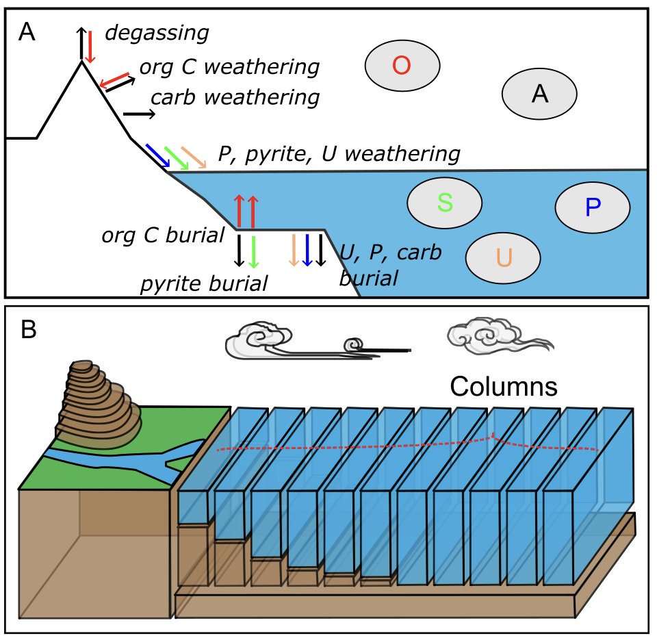

# Excitable Phosphorus Oxygen Carbon cycle model (EPOC)

Developed by SJD and ZHL in 2021-2023:

Stuart J. Daines (https://orcid.org/0009-0009-5386-4236, s.daines@exeter.ac.uk) 
Zi-Heng Li, 李子珩 ( https://orcid.org/0000-0003-4145-612X, zihengli@cug.edu.cn) 

SJD and ZHL were both working in Timothy M. Lenton's group. 

EPOC model inherited the most of the biogeochemical reactions from COPSE (*Bergman et al., 2004; Lenton et al., 2018*), while the zero-D ocean domain was replaced by a **column ocean** (see below). 

# Build the PALEO environment before you run the scripts

To install (Julia 1.10 required):

Change directory to examples

    julia> ] activate
    (examples) pkg> instantiate
    (examples) pkg> add https://github.com/PALEOtoolkit/NLsolve.jl#project_region
    (examples) pkg> precompile

# Examples

## Li et al (2025) 'Post-PTB paper'

*Li, Z.H., Lenton, T.M., Zhang, F.F., Chen, Z.Q. and Daines, S.J., 2025. Earth system instability amplified biogeochemical oscillations following the end-Permian mass extinction. Nature Communications, 16(1), p.3703.*

examples/li2025_PTB_NC/

## Li etal (2025) 'Gaskiers glaciation paper'

examples/li2025_Egan_NG/

## Daines & Li (2024) 'Theory paper'

examples/dainesli2024/

see examples/dainesli2024/README.md for work-in-progress 

# EPOC model code

src/...

## Code changes to run outside PALEOdev.jl repo

Remove import PALEOreactions (part of PALEOdev.jl repository)

Copy from PALEOdev/PALEOreactions to OOEOAE_base/PALEOreactions:
- Uranium.jl, AtmReservoirs.jl, Burial.jl, OceanTransportRomanielloShelf.jl

Copy from OOEOAE_base:
- OOEOAE_base/CarbBurial_dev.jl 
    from: PALEOcopse.jl\src\oceanfloor\CarbBurial.jl
        Update the mccb for each cell...
    and include in each of the P-O-A scripts 

- ReactionsOOEOAE_dev.jl
    - ReactionOceanBurialColumn: column ocean hierarchy 
    - ReactionOxWeathMinimal: simplified oxidw
    - ReactionUOceanfloor_dev: Uburial for each cell...

- SolverFunctionsOOEOAE2.jl
    Structure and functions to find the nullclines and other items in Phase plane.

- Isoline.jl
    src to support SolverFunctionsOOEOAE2.jl

- ooeoae_plots.jl
    Romaniello ocean plotting functions

