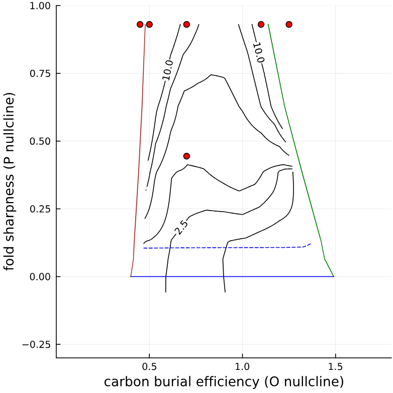
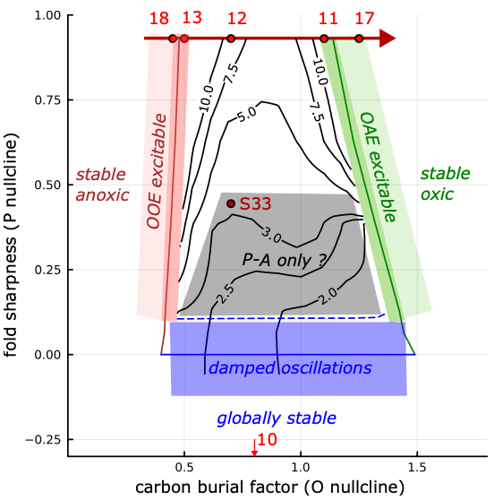

# Model configurations from Daines & Li (2024)

EPOC_model https://github.com/PALEOtoolkit/EPOC_model

examples/dainesli2024/

This folder is a partial copy of PALEOexamples\src\OOEOAE_base folder from
PALEOdev.jl repo, branch OOE_2021_Ziheng_dev2

    From:
        commit 74fa0878494557fd969518c637bec46e6e2e43d9 (HEAD -> OOE_2021_Ziheng_dev2, origin/OOE_2021_Ziheng_dev2)
        Author: Ziheng Li <zihengli@cug.edu.cn>
        Date:   Sun Jan 28 15:00:46 2024 +0800

(Daines & Li 2024 PNAS submission)

TODO 

- update to Sci Adv submission

    From:
        commit 51fcdb04b7aa1766024e9fff59230c80065a9287
        Author: Stuart Daines <s.daines@exeter.ac.uk>
        Date:   Sun May 26 13:06:52 2024 +0100

        This commit has git tag: DainesLi2024_SciAdv_submit

- update core code in ../../src/ to latest version with corresponding script changes if necessary

## Figure cross-reference
(from PNAS submitted version 2024-01, with renumbering and TODO to update for Sci Adv submitted version 2024-05)

TODO out-of-date master table of experiment parameters is OOEOAE_TableS1_sum_all_expts_20240103.xlsx

Figure graphics and README are in subfolders of Dropbox\BACE_OOEOAE\DainesLiOverleaf\Figures,
where the README documents that scripts used and the location and names of the intermediate png, svg
for the figure panels that are then composited in Inkscape.

Scripts are modified to reproduce output and save in ./figures/ instead of Dropbox/BACE_OOEOAE/DainesLiOverleaf/OOEOAE_base/

### Fig 1    Dropbox/BACE_OOEOAE/DainesLiOverleaf/Figures/Figure1_d13C_OOEOAE/
    Data compilation

### Fig 2  Model schematic  
    Dropbox/BACE_OOEOAE/DainesLiOverleaf/Figures/Figure1_model_schematic/

    (shelf area panel - see Fig S4 below)

### Fig 3  Local redox dependence...
### Fig 4 Timescale separation .. P O nullclines
    Dropbox/BACE_OOEOAE/DainesLiOverleaf/Figures/Figure2_PO_secular_stability_oscillation/

    1_P_O_columns_test/P_O_columns_Table2_sum_20231226.jl
        --> figures/P_O_columns_Table2_sum_20231226/PO_secular_stability_ocillation_summary_20231226.svg

    TODO this is out-of-date - need updated P_O_columns_Table2_sum_20231226.jl
        --> figures/PO_secular_stability_ocillation_summary_part1_20240416.svg (Fig 3)
        --> figures/PO_secular_stability_ocillation_summary_part2_20240416.svg (Fig 4)

    Instructions for out-of-date PNAS versions:
    - Step 1 script
        OOEOAE_base/1_P_O_columns_test/P_O_columns_Table2_sum_20231226.jl ->
    - Step 2 script plot into dropbox
        Dropbox/BACE_OOEOAE/DainesLiOverleaf/OOEOAE_base/1_P_O_columns_test/P_O_columns_Table2_sum_20231226/PO_secular_stability_ocillation_summary_20231226.svg
    - Step 3 diff versions of plot deposit
        Dropbox/BACE_OOEOAE/DainesLiOverleaf/Figures/Figure2_PO_secular_stability_oscillation/PO_secular_stability_ocillation_summary_20231227.svg

    

### Fig 5 Dynamics and stability of the coupled P, O, A system...
    Dropbox/BACE_OOEOAE/DainesLiOverleaf/Figures/Figure4_POAU_3D_sum_20231106

    TODO need updated ./2_P_O_A_U_columns_test/P_O_A_U_Table2_3D_sum_20240510.jl

    Instructions for out-of-date PNAS versions:
        - Step 1 script
            ./2_P_O_A_U_columns_test/P_O_A_U_Table2_3D_sum_20231122_graphicstest.jl -> 
        - Step 2 script plot into dropbox
            Dropbox/BACE_OOEOAE/DainesLiOverleaf/OOEOAE_base/2_P_O_A_U_columns_test/P_O_A_U_Table2_3D_sum_graphicstestP_O_A_U_Table2_3D_sum_graphicstest (all files in it) ->
        - Step 3 diff versions of plot deposit
            Dropbox/BACE_OOEOAE/DainesLiOverleaf/Figures/Figure4_POAU_3D_sum_20231106/Figure4_3D_phase_plane_sum_20240103.svg

### Fig 6 Rate-dependent forcing and excitation of an OAE in the P-O model ...
    Dropbox/BACE_OOEOAE/DainesLiOverleaf/Figures/Figure5_POA_Ppulse

    TODO may need updated 2_P_O_A_U_columns_test/P_O_A_U_Table3_1_20231227.jl ?
        --> P_O_excitability_rate_dependent_oxic_20240514.svg

    Instructions for out-of-date PNAS versions:
        - Step 1 script
            2_P_O_A_U_columns_test/P_O_A_U_Table3_1_20231227.jl ->
        - Step 2 script plot into dropbox
            Dropbox/BACE_OOEOAE/DainesLiOverleaf/OOEOAE_base/2_P_O_A_U_columns_test/P_O_A_U_Table3_1/P_O_excitability_rate_dependent_oxic_20231227.svg ->
        - Step 3 diff versions of plot deposit
            Dropbox/BACE_OOEOAE/DainesLiOverleaf/Figures/Figure5_POA_Ppulse/P_O_excitability_rate_dependent_oxic_20231229.svg
            
### Fig 7 (P-O-A OOE excitation by degassing reduction)
    Dropbox/BACE_OOEOAE/DainesLiOverleaf/Figures/Figure7_POAU_CO2pulse

    TODO may need update ?

    Instructions for out-of-date PNAS versions:        
        - Step 1 script
            OOEOAE_base/2_P_O_A_U_columns_test/P_O_A_U_Table4_4_rate_sum_20231203.jl -> 
        - Step 2 script plot into dropbox
            Dropbox/BACE_OOEOAE/DainesLiOverleaf/OOEOAE_base/2_P_O_A_U_columns_test/P_O_A_U_Table4_4_rate_sum/Rate_CO2pulse_summary_20231218.svg ->
        - Step 3 diff versions of plot deposit
            Dropbox/BACE_OOEOAE/DainesLiOverleaf/Figures/Figure7_POAU_CO2pulse/Rate_CO2pulse_summary_20231225.svg

### Fig 8 (P-O-A OAE excitation by CO2 pulse)
    Dropbox/BACE_OOEOAE/DainesLiOverleaf/Figures/Figure7_POAU_CO2pulse/

    TODO may need update?

    Instructions for out-of-date PNAS versions: 
        - Step 1 script
            OOEOAE_base/2_P_O_A_U_columns_test/P_O_A_U_Table4_1_excitability_sum_20231202.jl ->
        - Step 2 script plot into dropbox
            Dropbox/BACE_OOEOAE/DainesLiOverleaf/OOEOAE_base/2_P_O_A_U_columns_test/P_O_A_U_Table4_1_excitability_sum ->
        - Step 3 diff versions of plot deposit
            Dropbox/BACE_OOEOAE/DainesLiOverleaf/Figures/Figure7_POAU_CO2pulse/Excitability_CO2pulse_summary_20231221.svg

### Fig 9 P-O-A stochastic forcing
    Dropbox/BACE_OOEOAE/DainesLiOverleaf/Figures/Figure7_white_noise_change_regimes/
    
    2_P_O_A_U_columns_test/P_O_A_U_Table4_1_noise_SDE_change_regime_20240501.jl
        -> 2_P_O_A_U_columns_test/figures/P_O_A_U_Table7_white_noise_change_regimes/
            Whitenoise_oxic_anoxic_sum_20240511.svg

    TODO need the phase plane output ? Commented-out code in script ?

### Fig 10 (P-O-A regime diagram)
    Dropbox/BACE_OOEOAE/DainesLiOverleaf/Figures/Figure_regimes/

    TODO may need update?

    Instructions for out-of-date PNAS versions: 
        - Step 1 script
            ./2_P_O_A_U_columns_test/P_O_A_U_Table6_contour_fix_intersection.jl ->
            (NB: takes ~30mins to run a grid of models)
        - Step 2 script plot into dropbox
            Dropbox/BACE_OOEOAE/DainesLiOverleaf/OOEOAE_base/2_P_O_A_U_columns_test/P_O_A_U_Table6_contour_20231212/Fig6_Stability_diagram_Corg.svg ->
        - Step 3 diff versions of plot deposit
            Dropbox/BACE_OOEOAE/DainesLiOverleaf/Figures/Figure_regimes/regimes_20231221.svg, regimes_20231221.pdf
        

    ### Stability regimes [ZHL update]

        Stability regimes for coupled phosphorus-oxygen-carbon system. Secular evolution over Earth's history corresponds to the evolution from Proterozoic at low carbon burial effciency values to the Phanerozoic at high values.

<figcaption> Figure 1. Left: original version generated by top-level script P_O_A_U_Table6_contour_fix_intersection.jl. Right marked version with regimes and specific cases in manuscript https://eartharxiv.org/repository/view/7367/ <figcaption> 

    SJD this also works but without control over sizing ?
    
    
    #### Figure 1. Left: original version generated by top-level script P_O_A_U_Table6_contour_fix_intersection.jl. Right marked version with regimes and specific cases in manuscript https://eartharxiv.org/repository/view/7367/ 

### Fig S3 Romaniello global + shelves vs WOA evaluation
    Dropbox/BACE_OOEOAE/DainesLiOverleaf/Figures/FigureS2_romglb_transport/burial_shelves6_BioProdPrest_Martin_Ozaki2011_0p23_0p25_lowUpwHlatP.png

        ../P_O_romglb_shelf_20231218/P_O_romglb_vs_GLODAP_20240102.jl
            -> figures/P_O_romglb_shelf_20231216/P_O_romglb_vs_GLODAP_20240102/burial_shelves6_BioProdPrest_Martin_Ozaki2011_0p23_0p25_lowUpwHlatP.png

        ZHL TODO: I had to uncomment L95-98 to produce a plot ?

### Fig S4 Romaniello shelf area controls (expanded version of main paper Fig 1 panel C)

    Dropbox/BACE_OOEOAE/DainesLiOverleaf/Figures/Figure_ICBM_shelves/icbm_shelves_20231219.pdf

    ../P_O_romglb_shelf_20231218/  
        see README.md, this requires a sequence of scripts:
        
        julia> include("P_O_romglb_baseline2_20231218.jl")  # tune and plot shelf areas to prescribed Corg burial vs [O2] distribution
            -> figures/P_O_romglb_shelf_20231216/P_O_romglb_baseline_20231218/
                    Shelf_Area_Summary.svg
                    Accumulated_Sum_Corg_burial.svg

        julia> include("P_O_romglb_save_grid.jl")  # calculate and save grid P vs O2
            -> figures/P_O_romglb_shelf_20231216/P_O_romglb_save_grid_20231218/
            (netcdf gridded output for use by plot script below)
        
        julia> include("P_O_romglb_plot_grid.jl")  # plot contours of constant P burial in P - O plane
            -> figures/P_O_romglb_shelf_20231216/Pnullcline_Summary.svg (aka contours of constant P burial)

### Fig S5 P-O hysteresis bifurcation
    Dropbox/BACE_OOEOAE/DainesLiOverleaf/Figures/FigureSI_PO_secular_stability_oscillation/PO_secular_stability_SI_fix_intersection_20240103.pdf
        ./1_P_O_columns_test/P_O_columns_FigS1_20231202.jl
        -> figures\P_O_columns_FigS1_20231202
    ZHL TODO this script errors (at the end, seems to still produce the plots that were used) !!

### Fig S6 P-O waveform vs O nullcline
    Dropbox/BACE_OOEOAE/DainesLiOverleaf/Figures/FigureSI_PO_secular_stability_oscillation/PO_secular_stability_SI_waveform_20240103.pdf
        ./1_P_O_columns_test/P_O_columns_FigS1_20231202.jl
        -> figures\P_O_columns_FigS1_20231202

### Fig S7 P-O excitability and rate-dependent forcing
    Dropbox/BACE_OOEOAE/DainesLiOverleaf/Figures/Figure5_POA_Ppulse/P_O_excitability_rate_dependent_oxic_SI_20231229.pdf
    (expanded version of main paper figure above, uses same script)
        ./2_P_O_A_U_columns_test/P_O_A_U_Table3_1_20231227.jl
        -> figures\P_O_A_U_Table3_1

### TODO P-O-A sensitivity studies

### Fig S14 (OAE excitation by CO2 degassing ramp increase)
    Dropbox/BACE_OOEOAE/DainesLiOverleaf/Figures/Figure7_POAU_CO2pulse/Rate_CO2pulse_oxic_increase_summary_20240103.pdf
        OOEOAE_base/2_P_O_A_U_columns_test/P_O_A_U_Table4_1_rate_sum_20231130.jl
        -> figures\P_O_A_U_Table4_1_rate_sum

## Additional scripts

    To find corg burial eff parameter corresponding to folds (to set start points etc):
        OOEOAE_base\2_P_O_A_U_columns_test\P_O_A_U_test_folds_nullcline.jl
        -> figures\P_O_A_U_Table6